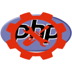

php-tools
==================



Debian package that contains additonal tools for PHP development using.

Installation:
-------------

```shell
sudo apt install lsb-release wget
echo "deb http://repo.vitexsoftware.cz $(lsb_release -sc) main" | sudo tee /etc/apt/sources.list.d/vitexsoftware.list
sudo wget -O /etc/apt/trusted.gpg.d/vitexsoftware.gpg http://repo.vitexsoftware.cz/keyring.gpg
sudo apt update
sudo apt install php-tools
```

Commands included
-----------------

 * **add-sury-debian-sources** - Add additonal php versions install sources
 * **disable-all-php-modules** - make no optional modules enabled

 * **installphp** - check current installed php modules and install same modules in other choosen php version
 * **php-modules** - list of avilble php modules

 * **usephp** - swith current webserver and commandline php to php5.6
 * **xdebug-mode** - set xdebug mode "debug" or "profile"
 * **php-devconf** - use development version of php.ini

usephp
------

Specify requested version of PHP as parameter or simply run **usephp** command to choose from availble versions


installphp
----------

1) Choose PHP versions you want install:


2) Choose packages 


3) Customize selection


4) Confirm instalation


